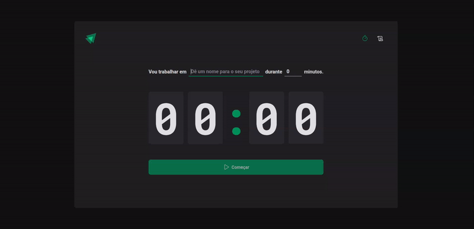
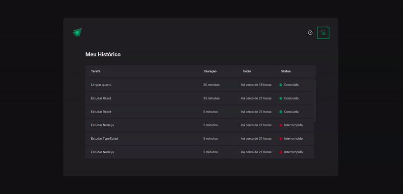

# Ignite-Timer

## Descrição

O Ignite-Timer é uma aplicação projetada para gerenciamento de tempo baseada no método Pomodoro. Permite aos usuários cronometrar precisamente o tempo dedicado a suas tarefas, com capacidade de configurar intervalos entre 5 e 60 minutos.

Na página inicial, o usuário encontra um cronômetro intuitivo onde pode nomear sua tarefa e definir seu tempo de duração. Já na seção de Histórico, é possível visualizar todas as tarefas anteriores através de uma tabela organizada com informações de Tarefa, Duração, Início e Status (que pode ser Concluído, Interrompido ou Em andamento).

  
  

## Tecnologias Utilizadas

- **React**: Biblioteca JavaScript para construção de interfaces de usuário com componentes reutilizáveis
- **Styled-Components**: Biblioteca que permite escrever CSS em JavaScript, criando componentes estilizados
- **React-Hook-Form**: Solução eficiente para gerenciamento de formulários com validações
- **React-Router**: Biblioteca de roteamento que permite navegação entre diferentes componentes
- **Zod**: Biblioteca de validação de esquemas TypeScript para garantir a integridade dos dados
- **Immer**: Facilita o trabalho com estados imutáveis em aplicações React
- **ESLint**: Ferramenta de análise de código para identificar e corrigir problemas
- **TypeScript**: Superconjunto tipado de JavaScript que melhora a qualidade e manutenção do código

## Objetivos de Aprendizado

Este projeto foi desenvolvido para o estudo aprofundado dos seguintes conceitos no React:

- **SPAs (Single Page Applications)**: Desenvolvimento de aplicações de página única com transições fluidas
- **Formulários Controlados e Não-Controlados**: Diferentes abordagens para manipulação de formulários no React
- **UseEffect**: Utilização do hook para lidar com efeitos colaterais e ciclo de vida dos componentes
- **UseReducer**: Implementação de lógica de estado mais complexa através deste hook
- **React-Router**: Criação e gerenciamento de rotas para navegação eficiente na aplicação

## Design

O projeto foi desenvolvido seguindo um protótipo criado no Figma:
[Link para o protótipo](https://www.figma.com/community/file/1127351821076435124)
